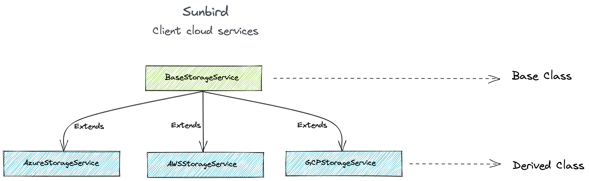

# Sunbird
## client-cloud-services

[](https://img.shields.io/npm/v/client-cloud-services.svg?style=for-the-badge&logo=npm)

Sunbird client cloud service is multi-cloud npm toolkit that provides access across cloud services while giving you full control to use cloud-specific features. Plugin allows users to provision their infrastructure in any cloud provider.

<p>
  
  
</p>

<!--  -->


---

## License

This project is licensed under the MIT License. See LICENSE for more information.

## Table of contents

- [Installation](#installation)
- [Usage](#usage)
- [Options](#options)
- [Releases](#releases)
---

### Installation


```
$ npm install --save client-cloud-services
```

### Usage

```
const cloudService  = require('client-cloud-services');

const config = {
  identity: CLOUD_IDENTITY,
  credential: CLOUD_IDENTITY_KEY,
  labelContainer: LABEL_CONTAINER_NAME
};

let client = cloudService.init(CLOUD_PROVIDER);
let storage = new client(config);

storage.SERVICE_NAME()...

```

### Options

1. Configuration for respective Cloud Providers

| Generalized keys |             Azure            |             AWS            |              GCP              |              OCI              | 
|:----------------:|:----------------------------:|:--------------------------:|:-----------------------------:|:-----------------------------:|
|     provider     |            `azure`           |            `aws`           |            `gcloud`           |            `oci`              |
|     identity     |      Azure Account Name      |       AWS Access Key       |        GCP Client Email       |        OCI S3 Access Key      |
|    credential    |       Azure Account Key      |       AWS Secret Key       |        GCP Private Key        |        OCI S3 Secret Key      |
|      region      |              --              |         AWS Region         |               --              |              OCI Region       |
|     projectId    |              --              |             --             |         GCP Project ID        |                --             |
|     endpoint     |              --              |             --             |               --              |        OCI S3 endpoint        |
|   containerName  |              --              |       AWS Bucket Name      |        GCP Bucket Name        |        OCI Bucket Name        |
| reportsContainer | Azure Reports Container Name | AWS Reports Container Name | GCloud Reports Container Name |   OCI Reports Container Name  |
|  labelsContainer |  Azure Labels Container Name |  AWS Labels Container Name |  GCloud Labels Container Name |   OCI Labels Container Name   |

### Releases

[Release Notes](/RELEASE.md)
